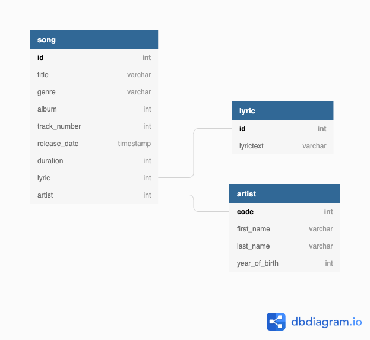

# SWENGS Homework

## Introduction

Frontend (Angular) + Backend (Django)



## Backend Setup

**Requirements**
django==2.2.7
djangorestframework==3.10.3
drf-yasg==1.17.0
djangorestframework-jwt==1.11.0

**Setup**
python3 manage.py makemigrations yamod
python3 manage.py migrate
python3 managy.py loaddata initial_lyrics.json
python3 manage.py createsuperuser
python3 manage.py runserver

**Connect**
http://127.0.0.1:8000/

**API Options**
http://127.0.0.1:8000/admin
http://127.0.0.1:8000/lyric/options
http://127.0.0.1:8000/song/list
http://127.0.0.1:8000/song/create
http://127.0.0.1:8000/song/<int:pk>/get
http://127.0.0.1:8000/song/<int:pk>/update
http://127.0.0.1:8000/song/<int:pk>/delete
http://127.0.0.1:8000/artist/list
http://127.0.0.1:8000/artist/create
http://127.0.0.1:8000/artist/<int:pk>/get
http://127.0.0.1:8000/artist/<int:pk>/update
http://127.0.0.1:8000/artist/<int:pk>/delete

**Tokens**
Get Token: curl -X POST -d "username=admin&password=admin" http://localhost:8000/api-token-auth/
Refresh Token: curl -X POST -H "Content-Type: application/json" -d '{"token":"<EXISTING_TOKEN>"}' http://localhost:8000/api-token-refresh/
Verify Token: curl -X POST -H "Content-Type: application/json" -d '{"token":"<EXISTING_TOKEN>"}' http://localhost:8000/api-token-verify/

Token Expiration Time: 5 Days

## Frontend Setup

npm install


## Features

**Special Libraries**
Angular Google Maps Library https://www.npmjs.com/package/@agm/core

**Validators**

```
belowZeroValidator()
// in song-form.component.ts to prevent a negative value for the song duration
```